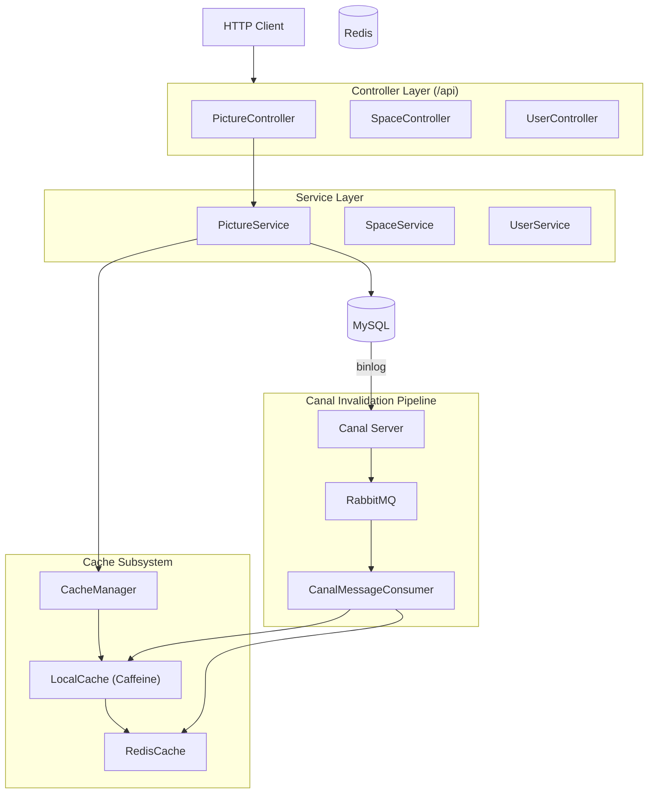

# SmartGalleryHub

智能图片管理平台后端服务，提供完整的图片生命周期管理、空间隔离、AI 分析和高性能缓存解决方案。 [1](#0-0) 

## ✨ 主要特性

- 🖼️ **完整的图片管理**：支持上传、编辑、删除、检索和批量操作
- 🏢 **空间隔离**：用户可创建私有空间和团队空间，支持细粒度权限控制
- 🤖 **AI 智能分析**：集成腾讯混元和阿里云 AI，提供图片分类、标签和描述生成
- ⚡ **多级缓存**：L1(Caffeine) + L2(Redis) 缓存架构，配合 Canal 实现自动缓存失效
- 📊 **分库分表**：基于 ShardingSphere 的图片表按空间分片
- 🔐 **双重认证**：Sa-Token 实现用户会话和空间会话双重认证
- 📡 **实时协作**：WebSocket 支持多人实时图片编辑

## 🛠️ 技术栈

| 技术领域 | 框架/库 | 版本 |
|---|---|---|
| Web 框架 | Spring Boot | 2.7.6 |
| ORM | MyBatis-Plus | 3.5.9 |
| 数据库分片 | ShardingSphere JDBC | 5.2.0 |
| L1 本地缓存 | Caffeine | 3.1.8 |
| L2 分布式缓存 | Redis | - |
| 消息队列 | RabbitMQ | - |
| 认证授权 | Sa-Token | 1.39.0 |
| 对象存储 | 腾讯云 COS | 5.6.227 |
| AI 分析 | 腾讯混元 | 3.1.1169 |
| API 文档 | Knife4j | 4.4.0 | [2](#0-1) 

## 🚀 快速开始

### 环境要求

- JDK 1.8+
- MySQL 5.7+
- Redis 3.0+
- RabbitMQ 3.0+

### 配置文件

主要配置在 `application.yml`： [3](#0-2) 

```yaml
server:
  port: 8123
  servlet:
    context-path: /api

spring:
  datasource:
    url: jdbc:mysql://localhost:3306/yu_picture
    username: root
    password: 123456
```

### 启动应用

```bash
# 克隆项目
git clone https://github.com/arousa1/SmartGalleryHub.git

# 进入项目目录
cd SmartGalleryHub

# 安装依赖
mvn clean install

# 启动应用
mvn spring-boot:run
```

应用启动后访问：http://localhost:8123/api

## 📚 API 文档

启动应用后访问 Swagger 文档：http://localhost:8123/api/doc.html

### 主要 API 端点

| 控制器 | 路径 | 功能 |
|---|---|---|
| `PictureController` | `/picture/*` | 图片上传、编辑、删除、查询 |
| `SpaceController` | `/space/*` | 空间管理、权限控制 |
| `SpaceAnalyzeController` | `/space/analyze/*` | 空间数据分析 |
| `UserController` | `/user/*` | 用户注册、登录、VIP |
| `FileController` | `/file/*` | 文件管理（管理员） | [4](#0-3) 

## 🏗️ 系统架构

### 核心架构图



### 缓存架构

采用 L1(Caffeine) + L2(Redis) 多级缓存，通过 Canal 监听数据库 binlog 实现自动缓存失效： [5](#0-4) 

### 权限系统

基于 Sa-Token 的双重会话认证：
- 用户会话：全局用户身份认证
- 空间会话：空间级别的权限控制

空间角色配置： [6](#0-5) 

## 🔧 开发指南

### 项目结构

```
src/main/java/com/yupi/yupicturebackend/
├── controller/          # 控制器层
├── service/            # 业务逻辑层
├── manager/            # 管理器层（缓存、AI、存储等）
├── model/              # 数据模型
├── mapper/             # 数据访问层
└── config/             # 配置类
```

### 缓存使用示例

```java
// 通过 CacheManager 使用多级缓存
PictureVO picture = cacheManager.getPictureVoById(pictureId);
```

### 权限注解使用

```java
@SaSpaceCheckPermission(value = SpaceUserPermissionConstant.PICTURE_UPLOAD)
public BaseResponse<PictureVO> uploadPicture(...) {
    // 业务逻辑
}
``` [7](#0-6) 

## 🤝 贡献指南

1. Fork 本仓库
2. 创建特性分支 (`git checkout -b feature/AmazingFeature`)
3. 提交更改 (`git commit -m 'Add some AmazingFeature'`)
4. 推送到分支 (`git push origin feature/AmazingFeature`)
5. 开启 Pull Request

## 📄 许可证

本项目采用 MIT 许可证 - 查看 [LICENSE](LICENSE) 文件了解详情

## 🙏 致谢

感谢以下开源项目的支持：
- [Spring Boot](https://spring.io/projects/spring-boot)
- [MyBatis-Plus](https://baomidou.com/)
- [Sa-Token](http://sa-token.dev33.cn/)
- [ShardingSphere](https://shardingsphere.apache.org/)
- [Caffeine](https://github.com/ben-manes/caffeine)

---

## Notes

- 本 README 基于项目的 wiki 页面和代码文件生成
- 更多详细技术文档请参考项目的 wiki 页面
- API 测试示例可参考 `httpTest/picture.http` 文件
- 缓存键生成策略详见 `CacheKeyGenerator` 类： [8](#0-7) 

Wiki pages you might want to explore:
- [Overview (arousa1/SmartGalleryHub)](/wiki/arousa1/SmartGalleryHub#1)

### Citations


